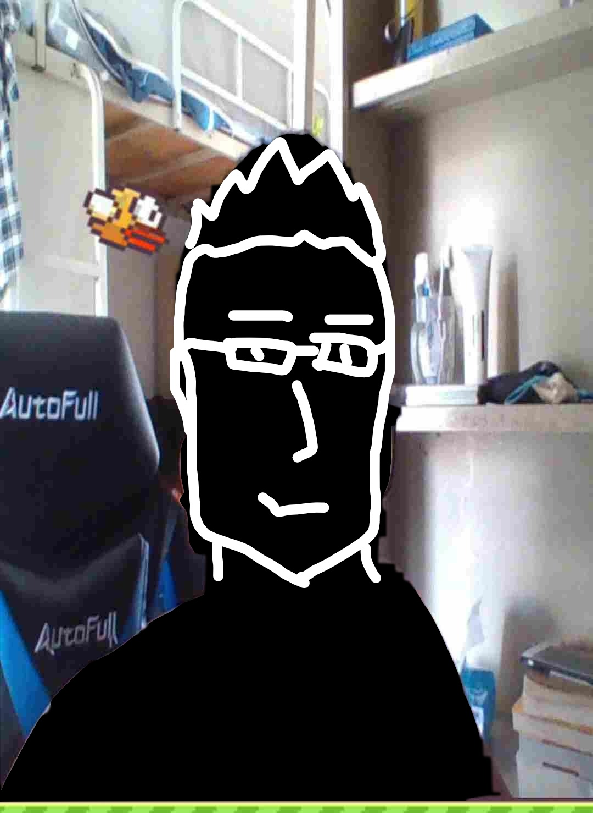

# StupidBirdWithFaceDetection
> 仿FlappyBird + 行为控制基于百度AI的人脸识别.
>> 通过人脸（如睁眼闭眼、张嘴闭嘴、抬头低头）控制鸟的行为

## Screen Shot

颜值较低，原图已扣。心生一意，略添几笔。

ps：保存本地使用Windows自带的图片查看还有墨水动画效果:)



## Development setup

项目依赖ai.Baidu及Json.net开发工具包，需要：

```
AipSdk.dll
Newtonsoft.Json.dll
```

项目内包含两种ai.Baidu提供的接口调用方式————api和Http SDK，分别对应项目中的OnlineFaceDetection.cs以及OfflineFaceDetection.cs文件。

注意，这里的Online...与Offline...都需要网络支持，并确保网络环境没有IP限制，无网络代理。所谓SDK只是基于API封装了一个简单调用工具包。真正的离线SDK需要在 <https://ai.baidu.com> 中进行注册与购买。（非打广告，感谢百度AI与Newtonsoft）

项目默认包含了System.Net等工具集，由于Unity对包括System.Net.dll,System.Drawing.dll等在内的C#类库支持较差，需要用户自己添加并引用。

上述类库文件均可在项目中的Asset/Plugins中找到，如有其它需要请自行导入。

再次注意，导入的dll版本需要被Unity当前使用的.Net版本所支持。

## Project Description

本项目处于未完成阶段，仅实现了基本核心功能部分，下面是未完成的功能：

- [ ] UI界面，包括开始界面、得分统计界面、退出界面等。
- [ ] 屏幕自适应
- [ ] 人脸控制鸟的飞行

#### 关于第最后一点，需要做一些说明。

获取到的人脸图像是需要转换成Base64的格式并传递给百度AI提供的接口调用的，这就引发了几个问题。

其一、图像格式问题。由于Base64格式是图像转换而来，如果图像分辨率过大，就会导致Base64占用的字节数过大，有可能是数十万量级甚至百万量级（亲测上万的量级就会导致处理延迟），这种量级的Base64格式百度AI在指定时间内是处理不了的，而如果对图像质量进行压缩，降低分辨率，则可能导致百度AI无法计算出正确的结果。

其二、调用次数问题。如果我监测的是眨眼这一动作，那我就需要再1秒内完成10次左右图像的采集与分析（人类眨眼时间约为0.2秒左右），也就是说我需要在0.1秒内完成截图、格式转换、接口调用、接口返回值处理等一系列操作，本人目前代码功力有限，暂时无法将所有这些处理过程限制在0.1秒内，因此会造成游戏的卡顿。

其三、SDK问题（个人理解）。由于api与Http SDK两种接口调用方式均需要网络进行传输，因此我认为主要的处理时间消耗在网络传输方面，而离线SDK价格不菲，本人还是学生，实在是捉襟见肘，无能为力。

其四、QPS问题。QPS（query per second）是指每秒向服务发送的请求数量峰值，相当于每个API接口每秒可以允许请求的并发上限量。由于需要在0.1秒内调用一次接口，而目前无法将处理时间限制在0.1秒内，则会导致上一次的接口请求还未返回结果，又进行了一次新的接口请求处理，因此引发了并发。百度AI提供的接口是有QPS限制的（免费情况下），超过限制则无法返回结果，因此无法得到图像处理的结果。

上述几点未完成的功能，有兴趣和能力的码友可以Fork并进行更改hhhhh。

## 最后

本项目仅作为学习参考与使用。

若所述有误，烦请指正，感谢！
